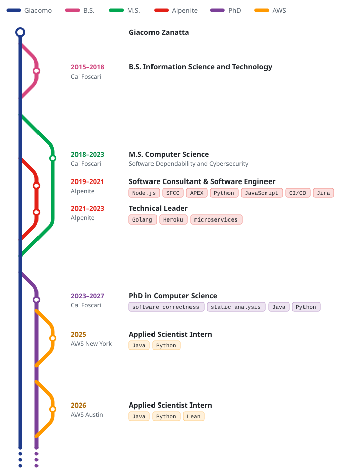

<div align="center">

# metro-cv

**Your career as a metro map, for your GitHub profile README.**

Describe your career in a short YAML file. metro-cv lays it out like a metro map, with lines
that branch off and merge back, and renders light and dark SVGs that follow each viewer's
GitHub theme.

[](https://github.com/giacomozanatta/metro-cv/actions/workflows/ci.yml)
[](LICENSE)

<picture>
  <source media="(prefers-color-scheme: dark)" srcset="examples/giacomo.dark.svg">
  
</picture>

</div>

## Contents

- [Quick start](#quick-start)
- [How it works](#how-it-works)
- [How-to guides](#how-to-guides)
- [Configuration reference](#configuration-reference)
- [Action reference](#action-reference)
- [CLI reference](#cli-reference)
- [Examples](#examples)
- [Development](#development)

## Quick start

These steps put a map on your profile page, the README of the repository named after your
username (`you/you`).

**1. Describe your career** in `metro-cv.yml` at the root of that repository:

```yaml
version: 1
main:
  label: Sam
  color: '#0f766e'
  origin: Sam Rivera
lines:
  - id: university
    label: University
    color: '#2563eb'
    stations:
      - title: B.Sc. Physics
        org: Northfield University
        from: 2016
        to: 2019

  - id: acme
    label: Acme
    color: '#dc2626'
    ongoing: true
    stations:
      - title: Data Analyst
        org: Acme
        from: 2019
        to: 2022
        tags: [SQL, Python]
      - title: Data Engineer
        org: Acme
        from: 2022
        tags: [Spark, Airflow, dbt]
```

**2. Add a workflow** at `.github/workflows/metro-cv.yml` that regenerates the map whenever the
config changes:

```yaml
name: metro-cv

on:
  push:
    paths: [metro-cv.yml]
  workflow_dispatch:

permissions:
  contents: write

# One run at a time, so two quick edits do not race to push.
concurrency:
  group: metro-cv
  cancel-in-progress: false

jobs:
  map:
    runs-on: ubuntu-latest
    steps:
      - uses: actions/checkout@v7
      - uses: giacomozanatta/metro-cv@v1
        with:
          commit: true
```

**3. Show the map** in your `README.md`:

```html
<picture>
  <source media="(prefers-color-scheme: dark)" srcset="metro-cv-dark.svg" />
  
</picture>
```

Push, and the workflow commits `metro-cv-light.svg` and `metro-cv-dark.svg` next to your config.
From then on, editing `metro-cv.yml` is all it takes to update the map.

## How it works

A map has a **main line**, which is you, and any number of **lines** for the parts of your
career: degrees, jobs, internships, side projects. Each line has **stations**, the things that
happened on it.

- A line **branches** off its parent when its first station starts and **merges** back after its
  last station ends. By default the parent is the main line; set `parent` to branch off another
  line instead, like an internship during a PhD.
- A line marked `ongoing` never merges back. It ends in a dotted tail, like the main line.
- Lines that overlap in time run side by side. A line whose lifetime sits inside another's
  always gets the inner lane, so nested lines never cross.
- When two lines only partially overlap, one crossing is unavoidable. metro-cv draws it as a
  bridge, the way real metro maps do.
- The map is ordinal, not to scale: stations are spaced for readability, in date order.

**Your words only.** Every piece of text on the map comes from your config. metro-cv never adds
words of its own: a period is either your `period` text or your own dates as you wrote them.

## How-to guides

### Branch a line off another line

Set `parent` to the id of the line it belongs to. The child must start and end within its parent:

```yaml
lines:
  - id: phd
    label: PhD
    color: '#7b3f98'
    ongoing: true
    stations:
      - title: PhD in Computer Science
        from: 2023
        to: 2027

  - id: internship
    label: Internship
    color: '#ff9900'
    parent: phd
    stations:
      - title: Applied Scientist Intern
        from: 2025
```

Lines can nest as deep as you like; see the [nested example](#examples).

### Write periods your way

`from` and `to` accept a year (`2019`) or a month (`'2019-03'`, quoted). The period column shows
them as written: `2019–2021`, or `2019-03–2021-09`. To show something else, set `period`:

```yaml
- title: Staff Engineer
  from: 2022
  period: since 2022
```

`from` also decides the order of stations and lines, so keep it accurate even when you override
the text.

A bare year covers the whole year. A PhD with `to: 2020` can therefore contain an internship
from `'2020-06'`, and metro-cv only reports a date as wrong when it certainly is: a child line
starting before its parent, or ending after it.

### Show a tech stack or a subtitle

Each station has a second row with either `tags`, drawn as small chips, or a `subtitle`:

```yaml
- title: Technical Leader
  org: Alpenite
  from: 2021
  to: 2023
  tags: [Golang, Heroku, microservices]

- title: M.S. Computer Science
  subtitle: Software Dependability and Cybersecurity
  from: 2018
  to: 2023
```

Chips wrap onto new rows to keep the map within 840 px, about the width of a GitHub README.
Titles never wrap, so a long one widens the map instead.

### Control colours in dark mode

The light SVG uses your colours exactly. For the dark SVG, metro-cv keeps any colour that is
visible on GitHub's dark background and lightens the others just enough, keeping their hue.
To choose the dark colour yourself, set `darkColor`:

```yaml
main:
  label: Giacomo
  color: '#1e3a8a'
  darkColor: '#5b8def'
```

Period text is adjusted separately in both themes to meet the WCAG contrast minimum for text.

### Preview locally before pushing

Run the CLI against your config and open the SVGs in a browser:

```sh
npx github:giacomozanatta/metro-cv metro-cv.yml --out-dir preview
```

### Generate without committing

Leave `commit` off to only write the files, then use the `changed` output in your own steps, for
example to open a pull request instead of pushing:

```yaml
- id: map
  uses: giacomozanatta/metro-cv@v1
  with:
    output-dir: assets
- if: steps.map.outputs.changed == 'true'
  run: echo "The map changed"
```

## Configuration reference

### Top level

| Field     | Required | Description                                                                      |
| --------- | -------- | -------------------------------------------------------------------------------- |
| `version` | yes      | Always `1`.                                                                      |
| `title`   | no       | Accessible name of the SVG (its `<title>`), read by screen readers.              |
| `main`    | yes      | The main line: you.                                                              |
| `lines`   | yes      | At least one line. They appear in the legend in this order, after the main line. |

### `main`

| Field       | Required | Description                                             |
| ----------- | -------- | ------------------------------------------------------- |
| `label`     | yes      | Legend label of the main line.                          |
| `color`     | yes      | Hex colour, like `'#1e3a8a'`.                           |
| `darkColor` | no       | Colour in the dark SVG. Derived from `color` if absent. |
| `origin`    | no       | Text of the station at the top of the map.              |

### Lines

| Field       | Required | Description                                                                         |
| ----------- | -------- | ----------------------------------------------------------------------------------- |
| `id`        | yes      | Lowercase id like `aws-nyc`, used by `parent`. `main` is reserved.                  |
| `label`     | yes      | Legend label. Lines with the same label and colours share one legend entry.         |
| `color`     | yes      | Hex colour.                                                                         |
| `darkColor` | no       | Colour in the dark SVG.                                                             |
| `parent`    | no       | Id of the line this one branches off. Defaults to the main line.                    |
| `ongoing`   | no       | `true` if the line has not ended. Only lines with an ongoing parent can be ongoing. |
| `stations`  | yes      | At least one station.                                                               |

### Stations

| Field      | Required | Description                                                      |
| ---------- | -------- | ---------------------------------------------------------------- |
| `title`    | yes      | Main text of the station.                                        |
| `from`     | yes      | Start: a year (`2019`) or a month (`'2019-03'`).                 |
| `to`       | no       | End, in the same format. Must not be earlier than `from`.        |
| `period`   | no       | Text for the period column. Defaults to `from–to` as written.    |
| `org`      | no       | Organisation, shown under the period.                            |
| `subtitle` | no       | Second row of text. Cannot be combined with `tags`.              |
| `tags`     | no       | List of tags shown as chips. Cannot be combined with `subtitle`. |

Mistakes are reported with their position in the file, like a compiler would:

```text
metro-cv.yml:14:13: "to" is earlier than "from" (at lines[2].stations[0].to)
```

In a workflow, the same errors appear as annotations on the config file.

## Action reference

### Inputs

| Input            | Default               | Description                                                       |
| ---------------- | --------------------- | ----------------------------------------------------------------- |
| `config`         | `metro-cv.yml`        | Path to the config.                                               |
| `output-dir`     | `.`                   | Directory for `metro-cv-light.svg` and `metro-cv-dark.svg`.       |
| `commit`         | `false`               | Commit and push the SVGs when they differ from what is committed. |
| `commit-message` | `Update metro-cv map` | Message of that commit.                                           |

With `commit: true`, the workflow needs `permissions: contents: write`, and must run on a
branch (for example on `push` or `workflow_dispatch`), not on a pull request's merge commit.
The action pushes with the credentials `actions/checkout` sets up; it takes no token input.

### Outputs

| Output    | Description                                    |
| --------- | ---------------------------------------------- |
| `light`   | Path of the light SVG.                         |
| `dark`    | Path of the dark SVG.                          |
| `changed` | `true` when either SVG was created or changed. |

Files are only written when their content changes, so a run without edits leaves the repository
untouched.

## CLI reference

```text
Usage: metro-cv [config] [options]

Arguments:
  config                YAML config file (default: metro-cv.yml)

Options:
  -o, --out-dir <dir>   directory for the SVGs (default: current directory)
      --png             also write PNG previews (needs the optional @resvg/resvg-js)
  -h, --help            show this help
  -v, --version         print the version
```

The exit code is `0` on success, `2` for invalid command-line usage, and `1` for everything
else: problems in the config, or files that cannot be read or written.

## Examples

Each example is a config in [`examples/`](examples) rendered by the test suite, so these images
are always up to date.

### A first job after a degree

[`examples/minimal.yml`](examples/minimal.yml)

<picture>
  <source media="(prefers-color-scheme: dark)" srcset="examples/minimal.dark.svg">
  
</picture>

### Overlapping lines, drawn as a bridge

[`examples/crossing.yml`](examples/crossing.yml)

<picture>
  <source media="(prefers-color-scheme: dark)" srcset="examples/crossing.dark.svg">
  
</picture>

### Lines inside lines

[`examples/nested.yml`](examples/nested.yml)

<picture>
  <source media="(prefers-color-scheme: dark)" srcset="examples/nested.dark.svg">
  
</picture>

### The author's career

[`examples/giacomo.yml`](examples/giacomo.yml) is the map at the top of this page.

## Development

metro-cv needs Node.js 24.

```sh
npm ci
npm run all       # format check, lint, typecheck, tests, bundle
npm run preview   # render every example to SVG and PNG in preview/
npm run examples  # refresh the example SVGs after an intended visual change
```

The code is a pure pipeline, with no DOM, so the same core can later run in a browser:

1. `src/config`: parse the YAML, validate it with positioned errors, and normalise it into a
   `Timeline`.
2. `src/layout`: order branch, station and merge events; give each line a lane; place everything
   vertically; build tracks, bridges, labels and the legend.
3. `src/render`: draw the layout as SVG for a theme.

`dist/` holds the bundled Action and CLI, plus the licenses of the packages bundled into them.
It is committed, because GitHub runs actions straight from the repository. CI fails if it is out
of date, so run `npm run bundle` before committing. Dependabot does not rebuild it: for an update
to a bundled dependency, check out the pull request, run `npm run bundle` and push the result.

## License

[MIT](LICENSE)
