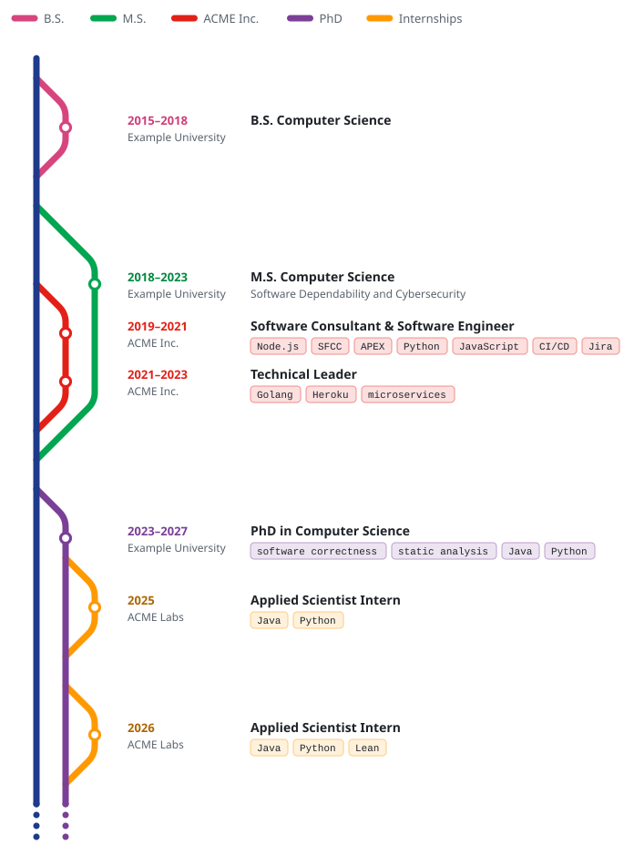
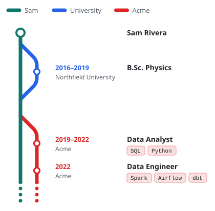
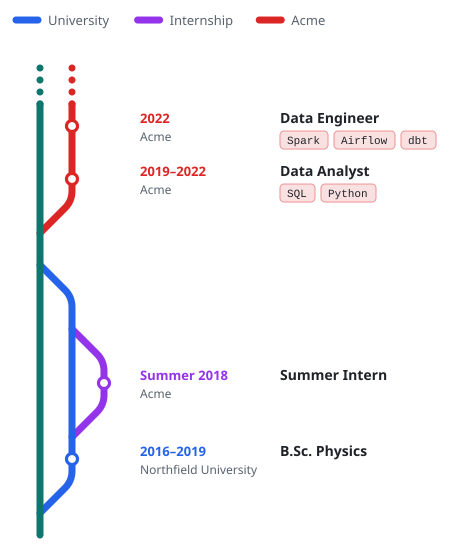
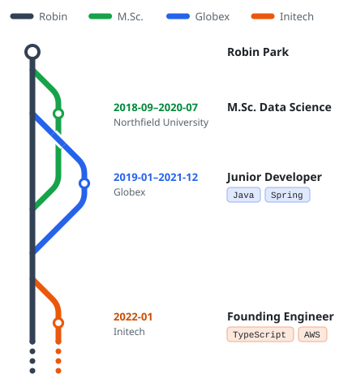
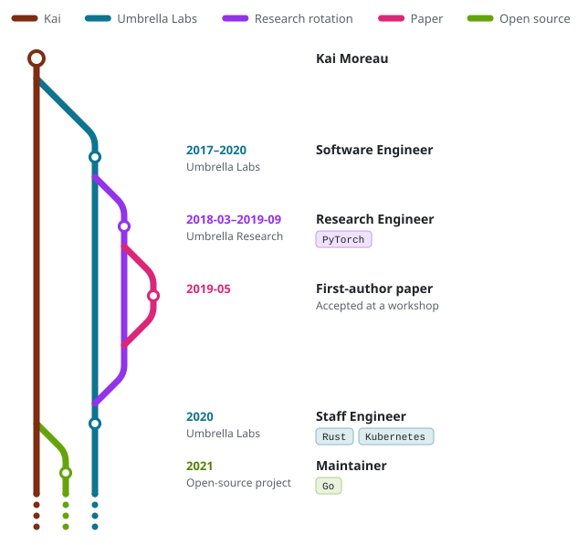

<div align="center">

# metro-cv

**Your career as a metro map, for your GitHub profile README.**

Describe your career in a short YAML file. metro-cv draws it as a metro map, where each part of
your career is a line that branches off and merges back. The SVGs it renders follow each
viewer's light or dark GitHub theme.

[](https://github.com/giacomozanatta/metro-cv/actions/workflows/ci.yml)
[](LICENSE)

<picture>
  <source media="(prefers-color-scheme: dark)" srcset="examples/showcase.dark.svg">
  
</picture>

</div>

## Contents

- [Quick start](#quick-start)
- [How it works](#how-it-works)
- [How-to guides](#how-to-guides)
- [Configuration reference](#configuration-reference)
- [Action reference](#action-reference)
- [CLI reference](#cli-reference)
- [Examples](#examples)
- [Development](#development)

## Quick start

Your profile page shows the README of the repository named after your username (`you/you`).
Three steps add a map to it.

**1. Describe your career** in `metro-cv.yml` at the root of that repository:

```yaml
version: 1
main:
  label: Sam
  color: '#0f766e'
  origin: Sam Rivera
lines:
  - id: university
    label: University
    color: '#2563eb'
    stations:
      - title: B.Sc. Physics
        org: Northfield University
        from: 2016
        to: 2019

  - id: acme
    label: Acme
    color: '#dc2626'
    ongoing: true
    stations:
      - title: Data Analyst
        org: Acme
        from: 2019
        to: 2022
        tags: [SQL, Python]
      - title: Data Engineer
        org: Acme
        from: 2022
        tags: [Spark, Airflow, dbt]
```

**2. Add a workflow** at `.github/workflows/metro-cv.yml`. It regenerates the map whenever the
config changes:

```yaml
name: metro-cv

on:
  push:
    paths: [metro-cv.yml]
  workflow_dispatch:

permissions:
  contents: write

# One run at a time: two quick edits must not race to push.
concurrency:
  group: metro-cv
  cancel-in-progress: false

jobs:
  map:
    runs-on: ubuntu-latest
    steps:
      - uses: actions/checkout@v7
      - uses: giacomozanatta/metro-cv@v1
        with:
          commit: true
```

**3. Show the map** in your `README.md`:

```html
<picture>
  <source media="(prefers-color-scheme: dark)" srcset="metro-cv-dark.svg" />
  
</picture>
```

After your next push, the workflow commits `metro-cv-light.svg` and `metro-cv-dark.svg` next to
your config. From then on, editing `metro-cv.yml` is all it takes to update the map.

## How it works

A map has a **main line**, which is you, and a **line** for each part of your career: degrees,
jobs, internships, side projects. The things that happened on a line are its **stations**.

- A line **branches** off its parent when its first station starts and **merges** back after its
  last station ends. Its parent is the main line unless you set `parent`, as for an internship
  during a PhD.
- A line marked `ongoing` never merges back. Like the main line, it ends in a dotted tail.
- Lines that overlap in time run side by side. A line whose lifetime lies inside another's takes
  the inner lane, and metro-cv avoids crossings wherever it can.
- A crossing that cannot be avoided, such as between two lines that only partially overlap, is
  drawn as a bridge, as on a real metro map.
- Each line passes under its parent where the two meet. The parent's track stays unbroken.
- The map is ordinal, not to scale. Stations appear in date order and are spaced for readability.

**Your words only.** All text on the map comes from your config. A period is either your own
`period` text or your dates exactly as you wrote them.

## How-to guides

### Put the newest first

Set `reversed: true` to draw the map the way most CVs are written, with the most recent things at
the top:

```yaml
version: 1
reversed: true
```

Every line keeps its lane. Ongoing lines fade out at the top instead of the bottom, and the
`origin` station moves to the bottom. See the [reversed example](#newest-first).

### Keep your name off the map

The main line's `label` and `origin` are both optional. Without them the map shows no name: the
main line has no legend entry and starts without a station.

```yaml
main:
  color: '#1e3a8a'
```

### Branch a line off another line

Set `parent` to the id of the line it belongs to. A child line must start and end within its
parent:

```yaml
lines:
  - id: phd
    label: PhD
    color: '#7b3f98'
    ongoing: true
    stations:
      - title: PhD in Computer Science
        from: 2023
        to: 2027

  - id: internship
    label: Internship
    color: '#ff9900'
    parent: phd
    stations:
      - title: Applied Scientist Intern
        from: 2025
```

Lines can nest to any depth, as in the [nested example](#lines-inside-lines).

### Write periods your way

`from` and `to` take a year (`2019`) or a month (`'2019-03'`, in quotes). The period column shows
them as written, such as `2019–2021` or `2019-03–2021-09`. Set `period` to show other text:

```yaml
- title: Summer Intern
  from: '2018-06'
  to: '2018-09'
  period: Summer 2018
```

`from` still decides where the station appears. Keep it accurate when you override the text.

A bare year covers the whole year. A PhD with `to: 2020` can contain an internship from
`'2020-06'`. metro-cv only rejects dates that are certainly wrong, such as a child line that
starts before its parent or ends after it.

### Show a tech stack or a subtitle

Below its title, a station shows either `tags`, drawn as chips, or a `subtitle`:

```yaml
- title: Technical Leader
  org: ACME Inc.
  from: 2021
  to: 2023
  tags: [Golang, Heroku, microservices]

- title: M.S. Computer Science
  subtitle: Software Dependability and Cybersecurity
  from: 2018
  to: 2023
```

Chips wrap onto new rows to keep the map within 840 px, about the width of a GitHub README.
Titles do not wrap. A long title makes the map wider.

### Control colours in dark mode

The light SVG uses your colours exactly. In the dark SVG, a colour that would be hard to see on
GitHub's dark background is lightened just enough, keeping its hue. Set `darkColor` to choose the
dark colour yourself:

```yaml
main:
  color: '#1e3a8a'
  darkColor: '#5b8def'
```

Period text is adjusted in both themes to meet the WCAG contrast minimum for text.

### Preview locally

Run the CLI against your config, then open the SVGs in a browser:

```sh
npx github:giacomozanatta/metro-cv metro-cv.yml --out-dir preview
```

### Generate without committing

Leave `commit` off to only write the files. The `changed` output tells later steps whether the
map changed, for example to open a pull request instead of pushing:

```yaml
- id: map
  uses: giacomozanatta/metro-cv@v1
  with:
    output-dir: assets
- if: steps.map.outputs.changed == 'true'
  run: echo "The map changed"
```

## Configuration reference

### Top level

| Field      | Required | Description                                                                      |
| ---------- | -------- | -------------------------------------------------------------------------------- |
| `version`  | yes      | Always `1`.                                                                      |
| `title`    | no       | Accessible name of the SVG (its `<title>`), read by screen readers.              |
| `reversed` | no       | `true` puts the newest things at the top.                                        |
| `main`     | yes      | The main line: you.                                                              |
| `lines`    | yes      | At least one line. They appear in the legend in this order, after the main line. |

### `main`

| Field       | Required | Description                                                                         |
| ----------- | -------- | ----------------------------------------------------------------------------------- |
| `label`     | no       | Legend label of the main line. Without it, the main line has no legend entry.       |
| `color`     | yes      | Hex colour, like `'#1e3a8a'`.                                                       |
| `darkColor` | no       | Colour in the dark SVG. Derived from `color` when absent.                           |
| `origin`    | no       | Text of the station where the main line begins: the top, or the bottom if reversed. |

### Lines

| Field       | Required | Description                                                                         |
| ----------- | -------- | ----------------------------------------------------------------------------------- |
| `id`        | yes      | Lowercase id like `acme-labs`, used by `parent`. `main` is reserved.                |
| `label`     | yes      | Legend label. Lines with the same label and colours share one legend entry.         |
| `color`     | yes      | Hex colour.                                                                         |
| `darkColor` | no       | Colour in the dark SVG.                                                             |
| `parent`    | no       | Id of the line this one branches off. Defaults to the main line.                    |
| `ongoing`   | no       | `true` if the line has not ended. Only lines with an ongoing parent can be ongoing. |
| `stations`  | yes      | At least one station.                                                               |

### Stations

| Field      | Required | Description                                                      |
| ---------- | -------- | ---------------------------------------------------------------- |
| `title`    | yes      | Main text of the station.                                        |
| `from`     | yes      | Start: a year (`2019`) or a month (`'2019-03'`).                 |
| `to`       | no       | End, in the same format. Must not be earlier than `from`.        |
| `period`   | no       | Text for the period column. Defaults to `from–to` as written.    |
| `org`      | no       | Organisation, shown under the period.                            |
| `subtitle` | no       | Second row of text. Cannot be combined with `tags`.              |
| `tags`     | no       | List of tags shown as chips. Cannot be combined with `subtitle`. |

Mistakes are reported with their position in the file, like compiler errors:

```text
metro-cv.yml:14:13: "to" is earlier than "from" (at lines[2].stations[0].to)
```

In a workflow run, the same errors appear as annotations on the config file.

## Action reference

### Inputs

| Input            | Default               | Description                                                       |
| ---------------- | --------------------- | ----------------------------------------------------------------- |
| `config`         | `metro-cv.yml`        | Path to the config.                                               |
| `output-dir`     | `.`                   | Directory for `metro-cv-light.svg` and `metro-cv-dark.svg`.       |
| `commit`         | `false`               | Commit and push the SVGs when they differ from what is committed. |
| `commit-message` | `Update metro-cv map` | Message of that commit.                                           |

With `commit: true`, the workflow needs `permissions: contents: write` and must run on a branch,
for example on `push` or `workflow_dispatch`. It cannot commit on a pull request's merge commit.
The action pushes with the credentials that `actions/checkout` sets up and takes no token input.

### Outputs

| Output    | Description                                    |
| --------- | ---------------------------------------------- |
| `light`   | Path of the light SVG.                         |
| `dark`    | Path of the dark SVG.                          |
| `changed` | `true` when either SVG was created or changed. |

The action writes a file only when its content changes. A run without edits leaves the repository
untouched.

## CLI reference

```text
Usage: metro-cv [config] [options]

Arguments:
  config                YAML config file (default: metro-cv.yml)

Options:
  -o, --out-dir <dir>   directory for the SVGs (default: current directory)
      --png             also write PNG previews (needs the optional @resvg/resvg-js)
  -h, --help            show this help
  -v, --version         print the version
```

The exit code is `0` on success, `2` for invalid command-line usage and `1` for anything else,
such as problems in the config or files that cannot be read or written.

## Examples

Each example is a config in [`examples/`](examples). The test suite checks that every image
below matches its config. The map at the top of this page is
[`examples/showcase.yml`](examples/showcase.yml).

### A first job after a degree

[`examples/minimal.yml`](examples/minimal.yml)

<picture>
  <source media="(prefers-color-scheme: dark)" srcset="examples/minimal.dark.svg">
  
</picture>

### Newest first

[`examples/reversed.yml`](examples/reversed.yml)

<picture>
  <source media="(prefers-color-scheme: dark)" srcset="examples/reversed.dark.svg">
  
</picture>

### Overlapping lines, drawn as a bridge

[`examples/crossing.yml`](examples/crossing.yml)

<picture>
  <source media="(prefers-color-scheme: dark)" srcset="examples/crossing.dark.svg">
  
</picture>

### Lines inside lines

[`examples/nested.yml`](examples/nested.yml)

<picture>
  <source media="(prefers-color-scheme: dark)" srcset="examples/nested.dark.svg">
  
</picture>

## Development

metro-cv needs Node.js 24.

```sh
npm ci
npm run all       # format check, lint, typecheck, tests, bundle
npm run preview   # render every example to SVG and PNG in preview/
npm run examples  # re-render the example SVGs after an intended visual change
```

The code is a pure pipeline with no DOM. The same core can later run in a browser.

1. `src/config` parses the YAML, validates it with positioned errors and normalises it into a
   `Timeline`.
2. `src/layout` orders branch, station and merge events, gives each line a lane, places
   everything vertically and builds tracks, bridges, labels and the legend.
3. `src/render` draws the layout as SVG in a theme.

`dist/` holds the bundled Action and CLI and the licenses of the packages bundled into them. It
is committed because GitHub runs actions straight from the repository. CI fails when it is out of
date: run `npm run bundle` before committing. Dependabot does not rebuild it. For an update to a
bundled dependency, check out the pull request, run `npm run bundle` and push the result.

## License

[MIT](LICENSE)
